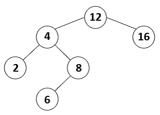

# Motivação

Como dito em aula, a complexidade das operações sobre a árvore binária de busca depende diretamente da altura da árvore. No pior caso, uma BST poderá ter altura O(n)
, o que acontece quando você entra as chaves na árvore em ordem crescente ou decrescente, por exemplo. Neste caso a árvore é chamada de árvore zig-zag e corresponde a uma degeneração da árvore em lista encadeada.

Em função da observação anterior, a árvore binária de busca é de pouca utilidade para ser aplicada em problemas de busca em geral. Daí o interesse em árvores balanceadas, cuja altura seja da ordem de O(logn)
 no pior caso. 

Um exemplo de árvore balanceada que já vimos na disciplina é a árvore completa. Como provado em aula, uma árvore completa possui altura igual a ⌈lg2(n+1)⌉
. Logo, em uma árvore completa, as operações de busca são realizadas em O(logn)
 no pior caso, o que é muito eficiente!!

# Atividade

Nesta atividade, você vai receber uma sequência das chaves a serem inseridas na árvore e essa sequência de chaves estará em ordem crescente de seus valores. Após ler as chaves em ordem crescente, você deve encontrar um jeito de inserir essas chaves na árvore de modo que a árvore binária de busca seja completa no final.

A fim de fazer isso, você deve escrever uma função recursiva com o seguinte protótipo:

### void construirBST_balanceada(BST *t, int A[], int p, int q);
Explicação da função:
Essa função recursiva recebe como entrada:
(1) Um ponteiro para uma BST vazia;

(2) Um vetor de inteiros A[p..q]
 em ordem crescente com q−p+1 elementos, o inteiro p é o índice inicial e o inteiro q é o índice final. Ao final da execução dessa função, a BST deve ser uma árvore completa. Como provada em aula, uma árvore binária completa com n nós tem altura igual a ⌈log2(n+1)⌉=⌊log 2n⌋+1.
 

# Ajuda

A atividade já vem com um código implementado para você seguir como ponto de partida.

O método bshow da árvore imprime a árvore em um formato amigável. Você pode utilizá-lo para conferir se seu código está funcionando corretamente.

Os locais onde você deve colocar seu código estão marcados com //TODO. 

### Exemplo de Entrada:

<pre>
<code>
3 4 5 6 7 8 12 13 14 15 16 17 18 19 22 24 25 26 27 34 35 36 37 38 39 40 41 50 55 56 57 60 61 70 71 72 73
</code>
</pre>

### Exemplo de Saída:

## Arquivos requeridos.

#### main.cpp
<pre>
<code>
#include <iostream>
#include <string>
#include <vector>
#include <sstream>
#include "bst.h"
using namespace std;
#define MAX 70

// Funcao recursiva 'construirBST_balanceada'
// Essa funcao recebe como entrada:
// (1) Um ponteiro para uma BST vazia;
// (2) Um vetor de inteiros A[p..q] em ordem crescente com q-p+1 elementos: 
// o numero p eh o indice inicial do vetor e o numero q eh o indice final do vetor
// Ao final da execucao dessa funcao, a BST deve ser uma arvore completa.
// Uma arvore completa com n nos tem altura igual ao piso( log_2(n) ) + 1.
void construirBST_balanceada(BST *t, int A[], int p, int q) {
    // TODO
}

int main()
{
    BST arv;
    string skeys;
    vector<int> vec;
    int value;

    getline(cin, skeys); // read a string containing all keys separated by spaces

    stringstream ss { skeys };
    
    while(ss >> value) 
        vec.push_back(value);

    int n = vec.size();
    int A[MAX];

    for(int i = 0; i < n; i++) 
        A[i] = vec[i];
    
    construirBST_balanceada(&arv, A, 0, n-1);

    cout << "height: " << arv.height() << endl;
    arv.bshow();

    return 0;
}
</code>
</pre>

### bst.h
<pre>
<code>
#ifndef BST_H
#define BST_H
#include <iostream>
#include <string>
using namespace std;

/*****************************
 * Definicao do struct Node
 *****************************/
struct Node {
    int key;
    Node *left;
    Node *right;

    // Construtor
    Node(int k, Node* l = nullptr, Node* r = nullptr) {
        this->key = k;
        this->left = l;
        this->right = r;
    }
};

/************************
 * Declaracao da classe
 ************************/
class BST {
public:
    BST();
    BST(int k);
    void bshow();
    bool add(int k);  //  ---> Completar
    int height();
    ~BST();
private:
    Node *root;
    //Node *_add(Node *node, int key); // ---> Descomente se voce precisar implementar essa funcao recursiva
    void bshow(Node *node, std::string heranca);
    Node *clear(Node *node);
    int height(Node *node);
};

/*****************************
 * Implementacao da classe
 *****************************/
BST::BST() {
    root = nullptr;
}

BST::BST(int k) {
    root = new Node(k);
}

void BST::bshow(){
    bshow(root, "");
}

void BST::bshow(Node *node, std::string heranca) {
    if(node != nullptr && (node->left != nullptr || node->right != nullptr))
        bshow(node->right , heranca + "r");
    for(int i = 0; i < (int) heranca.size() - 1; i++)
        std::cout << (heranca[i] != heranca[i + 1] ? "│   " : "    ");
    if(heranca != "")
        std::cout << (heranca.back() == 'r' ? "┌───" : "└───");
    if(node == nullptr){
        std::cout << "#" << std::endl;
        return;
    }
    std::cout << node->key << std::endl;
    if(node != nullptr && (node->left != nullptr || node->right != nullptr))
        bshow(node->left, heranca + "l");
}

Node *BST::clear(Node *node) {
    if(node != nullptr) {
        node->left = clear(node->left);
        node->right = clear(node->right);
        delete node;
    }
    return nullptr;
}

BST::~BST() {
    root = clear(root);
}

int BST::height() {
    return height(root);
}

int BST::height(Node *node) {
    if(node == nullptr) return 0;
    else return 1 + std::max(height(node->left), height(node->right));
}

// Funcao publica 'add'
// Esta funcao pode ser implementada sem usar recursividade e sem usar nenhuma estrutura
// de dados adicional. Porem, deixarei aberta a forma como voce decidir implementa-la.
// Voce pode implementa-la como quiser, contanto que ela funcione e, de fato, crie uma
// arvore binaria de busca (BST).
// Esta funcao adiciona um no com chave k na arvore e: 
// (1) devolve true em caso de sucesso;
// (2) devolve false caso contrario.
// Lembre-se que nao podem haver chaves repetidas na nossa arvore.
bool BST::add(int k) {
    // TO DO: adicione aqui o seu codigo 
}

/*
// Descomente esta funcao caso voce precise implementar uma versao auxiliar
// recursiva para a funcao de adicionar nodes na arvore
Node *BST::_add(Node *node, int key) {

}
*/

#endif  
</code>
</pre>