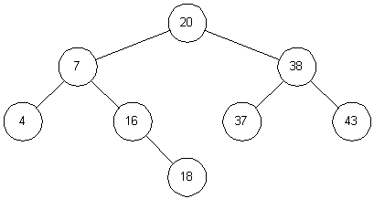

# Descrição

Durante as aulas, estudamos a estrutura de dados árvore binária de busca (uma árvore em que as chaves dos nós possuem uma relação de ordem entre si). É uma estrutura de dados baseada em nós, onde todos os nós da subárvore esquerda possuem um valor numérico inferior ao nó raiz e todos os nós da subárvore direita possuem um valor superior ao nó raiz. A figura acima ilustra uma árvore binária de busca.

O objetivo desta árvore é estruturar os dados de forma a permitir busca binária.

# Considerações sobre a complexidade das operações numa árvore binária de busca

A complexidade das operações sobre árvore binária de busca (ABB) depende diretamente da altura da árvore. Uma árvore binária de busca com chaves aleatórias uniformemente distribuídas tem altura O(log n). No pior caso, uma ABB poderá ter altura O(n). Neste caso a árvore é chamada de árvore zig-zag e corresponde a uma degeneração da árvore em lista encadeada. Em função da observação anterior, a árvore binária de busca é de pouca utilidade para ser aplicada em problemas de busca em geral. Daí o interesse em árvores balanceadas, cuja altura seja O(log n) no pior caso. Árvores binárias de busca balanceadas, como as AVL e as Rubro-Negras, serão vistas mais à frente no curso.

# Atividade

Em aula, vimos uma implementação de uma ABB em que os nós possuíam ponteiros apenas para os filhos esquerdo e direito.

Para esta atividade você deve implementar as operações de inserção de chaves e de busca em uma árvore binária de busca cujos nós possuem ponteiro para o pai.

Além disso, as funções a serem implementadas devem obrigatoriamente serem iterativas (não é permitido usar recursividade para solucionar esse exercício)

Parte das funções já está programada. Você deve implementar apenas as seguintes funções:

### bool BST::add(int k);

Esta função pública adiciona um nó com chave k na árvore e então:

 1 . Devolve true em caso de sucesso;
 2 . Devolve false caso contrário (se a chave for repetida).
 
Lembre-se que não podem haver chaves repetidas na nossa árvore binária de busca. Esta função deve obrigatoriamente ser iterativa. Também não é permitido usar estruturas de dados adicionais nessa função, apenas a árvore e sua estrutura já é suficiente.

### Node *BST::search(int k);
Esta função privada devolve o ponteiro para o nó que contém a chave k
se ela existir na árvore; caso contrário, devolve nullptr. Esta função deve obrigatoriamente ser iterativa. Também não é permitido usar estruturas de dados adicionais nessa função, apenas a árvore e sua estrutura já é suficiente.

### bool BST::contains(int k)

Esta função pública devolve true se a árvore contem a chave k; ou devolve false caso contrário. Também não é permitido usar estruturas de dados adicionais nessa função, apenas a árvore e sua estrutura já é suficiente.

# Ajuda

A atividade já vem com um código implementado para você seguir como ponto de partida.

O método bshow da árvore imprime a árvore em um formato amigável. Você pode utilizá-lo para conferir se seu código está funcionando corretamente.

Os locais onde você deve colocar seu código estão marcados com //TODO.

### Exemplo de Entrada:

<pre>
<code>
23 24 25 26 27 28 29 30 31 32 33 34 35 36 37 38 39 40
</code>
</pre>

### Exemplo de Saída:
<pre>
<code>
23 24 25 26 27 28 29 30 31 32 33 34 35 36 37 38 39
Nao contem 5
Nao contem 78
Nao contem 0
Node removed: 40
Node removed: 39
Node removed: 38
Node removed: 37
Node removed: 36
Node removed: 35
Node removed: 34
Node removed: 33
Node removed: 32
Node removed: 31
Node removed: 30
Node removed: 29
Node removed: 28
Node removed: 27
Node removed: 26
Node removed: 25
Node removed: 24
Node removed: 23
</code>
</pre>

## Arquivos requeridos.

#### main.cpp
<pre>
<code>
#include <iostream>
#include <string>
#include <sstream> // cabecalho que define o tipo stringstream
#include "bst.h"
using namespace std;

int main()
{
    BST arv;
    string keys;
    getline(cin, keys); // ler uma string com todas as chaves

    stringstream ss { keys };
    int value;

    while(ss >> value) 
        arv.add(value); // Adiciona chaves na arvore

    arv.inorderParent();

    cout << endl;

    if(arv.contains(5))
        cout << "Contem 5" << endl;
    else
        cout << "Nao contem 5" << endl;

    if(arv.contains(78))
        cout << "Contem 78" << endl;
    else
        cout << "Nao contem 78" << endl;

    if(arv.contains(0))
        cout << "Contem 0" << endl;
    else
        cout << "Nao contem 0" << endl;
    
    return 0;
}
</code>
</pre>

### bst.h
<pre>
<code>
#ifndef BST_H
#define BST_H
#include <iostream>
#include <stack>
#include <string>
using namespace std;

/***********************************
 * Definicao do struct Node
 ***********************************/
struct Node {
    int key;
    Node *left;
    Node *right;
    Node *parent;

    // Construtor
    Node(int k, Node* l = nullptr, Node* r = nullptr, Node* p = nullptr) {
        this->key = k;
        this->left = l;
        this->right = r;
        this->parent = p;
    }
    // Destrutor
    ~Node() {
        cout << "Node removed: " << this->key << endl;
    }
};

/***********************************
 * Declaracao da classe
 ***********************************/
class BST {
public:
    BST();
    BST(int k);
    void bshow();
    bool add(int k); // ---> Implementar
    bool contains(int k); // ---> Implementar
    void inorderParent();
    ~BST();
private:
    Node *root;
    void bshow(Node *node, std::string heranca);
    Node *clear(Node *node); 
    Node *search(int k); // ---> Implementar
};

/************************************
 * Implementacao da classe
 ************************************/
// Constructor 1
BST::BST() {
    root = nullptr;
}

// Constructor 2
BST::BST(int k) {
    root = new Node(k);
}

void BST::bshow(){
    bshow(root, "");
}

void BST::bshow(Node *node, std::string heranca) {
    if(node != nullptr && (node->left != nullptr || node->right != nullptr))
        bshow(node->right , heranca + "r");
    for(int i = 0; i < (int) heranca.size() - 1; i++)
        std::cout << (heranca[i] != heranca[i + 1] ? "│   " : "    ");
    if(heranca != "")
        std::cout << (heranca.back() == 'r' ? "┌───" : "└───");
    if(node == nullptr){
        std::cout << "#" << std::endl;
        return;
    }
    std::cout << node->key << std::endl;
    if(node != nullptr && (node->left != nullptr || node->right != nullptr))
        bshow(node->left, heranca + "l");
}

Node *BST::clear(Node *node) {
    if(node != nullptr) {
        node->left = clear(node->left);
        node->right = clear(node->right);
        delete node;
    }
    return nullptr;
}

BST::~BST() {
    root = clear(root);
}

// Percorre os nos da arvore em ordem simetrica, imprimindo os pais
void BST::inorderParent() {
    stack<Node*> p; // Cria pilha do tipo Node* (ponteiro para Node)
    if(root != nullptr)
        p.push(root);
    while(!p.empty()) {
        Node *no = p.top();
        p.pop();
        if(no->parent != nullptr) cout << no->parent->key << " ";
        if(no->right != nullptr) p.push(no->right);
        if(no->left != nullptr) p.push(no->left);
    }
}

// Funcao publica 'add'
// Esta funcao deve obrigatoriamente ser iterativa.
// Esta funcao adiciona um no com chave k na arvore e: 
// (1) devolve true em caso de sucesso;
// (2) devolve false caso contrario.
// Lembre-se que nao podem haver chaves repetidas na nossa arvore.
bool BST::add(int k) {
    //TODO
}

// Funcao privada 'search'
// Esta funcao devolve o ponteiro para o no que 
// contem a chave k se ela existir na arvore;
// caso contrario, devolve nullptr;
Node *BST::search(int k) {
    //TODO
}

// Funcao publica 'contains'
// Esta funcao devolve 'true' se a arvore contem a chave k; 
// e devolve 'false' caso contrário.
bool BST::contains(int k) {
    //TODO
}

#endif 
</code>
</pre>