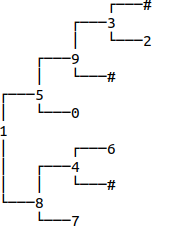

# Atividade


<ul>

### Entrada

<li>linha 1: o serial de uma árvore binária</li>
<li>linha 2: um valor de nó</li>

### Saída
<em>se o valor existe:</em>

<li>mostre o caminho da raiz até o nó,</li>
<li>indicando ‘l’ ou ‘r’ se o caminho é pelo filho da esquerda ou da direita, respectivamente.</li>
<li>ponha um ‘x’ para quando achar o nó.</li>

### Se o valor não existir na árvore
<li>imprima “!”</li>

### Limitação
<li>Você deve percorrer a árvore UMA única vez para obter os caminhos e montar o caminho através do retorno da função.</li>

</ul>

# Exemplo

Para encontrar o 2 na árvore abaixo, seguimos o caminho rrrlx

```
//serial
1 8 7 # # 4 # 6 # # 5 0 # # 9 # 3 2 # # #

//bshow()
```



//a função recursiva find deve retornar uma sequencia o path até o destino com x no final
string find_path(Node * root, int value);

## Testes

```
>>>>>>>> 01 um
4 # #
4
========
x
<<<<<<<<

>>>>>>>> 02 dois
1 # 0 # # 
0
========
rx
<<<<<<<<

>>>>>>>> 03 tres
4 # 8 2 # # # 
2
========
rlx
<<<<<<<<

>>>>>>>> 04 not found
0 9 4 # # # 5 # # 
7
========
!
<<<<<<<<

>>>>>>>>
1 8 7 # # 4 # 6 # # 5 0 # # 9 # 3 2 # # #
2
========
rrrlx
<<<<<<<<
```

## Arquivos requeridos

#### main.cpp
<pre>
<code>
#include <iostream>
#include <string>
#include "Tree.h"
using namespace std;

int main()
{
    string line;
    getline(cin, line);
    Tree bt(line);
    int value;
    cin >> value;
    string path = bt.find_path(value);
    cout << path << endl;
    return 0;
}
</code>
</pre>


#### Tree.h
<pre>
<code>
#ifndef TREE_H
#define TREE_H
#include <string>
#include <sstream>

struct Node;

class Tree {
public:
    Tree(std::string serial);
    void inorder();   // percurso em ordem simetrica
    void bshow();
    std::string find_path(int value);
    ~Tree();
private:
    Node *_root;
    Node *_clear(Node *root);
    void _inorder(Node *node);
    void _bshow(Node *node, std::string heranca);
    void _serializeTree(std::stringstream& ss, Node **node);
    std::string _find_path(Node *node, int value);
};

#endif
</code>
</pre>

#### Tree.cpp

<pre>
<code>
#include <iostream>
#include <sstream>
#include <string>
#include "Tree.h"

struct Node {
    int key;
    Node *left;
    Node *right;

    Node(int k, Node *l = nullptr, Node *r = nullptr) {
        this->key = k;
        this->left = l;
        this->right = r;
    }
};


Tree::Tree(std::string serial) {
    std::stringstream ss(serial);
    _serializeTree(ss, &_root);
}


void Tree::_serializeTree(std::stringstream& ss, Node **node) {
    std::string value;
    ss >> value;
    if(value == "#") // filho == nullptr
        return;
    int key = std::stoi(value);
    *node = new Node(key);
    _serializeTree(ss, &((*node)->left));
    _serializeTree(ss, &((*node)->right));
}

Tree::~Tree() {
    _clear(_root);
}

Node *Tree::_clear(Node *node) {
    if(node != nullptr) { // caso geral: vamos liberar essa arvore
        node->left = _clear(node->left);
        node->right = _clear(node->right);
        delete node;
    }
    return nullptr;
}

void Tree::inorder() {
    _inorder(_root);
}

void Tree::_inorder(Node *node) {
    if(node != nullptr) { // Caso Geral
        _inorder(node->left);
        std::cout << node->key << " ";
        _inorder(node->right);  
    }
}

void Tree::bshow(){
    _bshow(_root, "");
}

void Tree::_bshow(Node *node, std::string heranca) {
    if(node != nullptr && (node->left != nullptr || node->right != nullptr))
        _bshow(node->right , heranca + "r");
    for(int i = 0; i < (int) heranca.size() - 1; i++)
        std::cout << (heranca[i] != heranca[i + 1] ? "│   " : "    ");
    if(heranca != "")
        std::cout << (heranca.back() == 'r' ? "┌───" : "└───");
    if(node == nullptr){
        std::cout << "#" << std::endl;
        return;
    }
    std::cout << node->key << std::endl;
    if(node != nullptr && (node->left != nullptr || node->right != nullptr))
        _bshow(node->left, heranca + "l");
}

std::string Tree::find_path(int value) {
    // TODO
}

std::string Tree::_find_path(Node *node, int value) {
    // TODO
}
</code>
</pre>