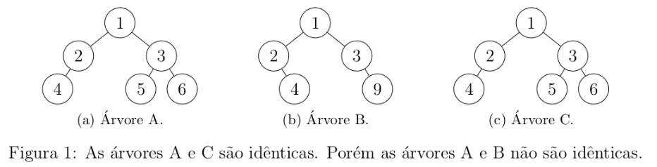
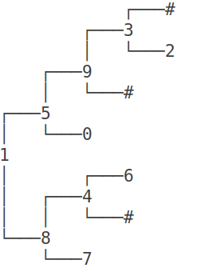

# Atividade

Para esta atividade, é pedido que você incremente a implementação da árvore binária generalizada, implementando as seguintes funções adicionais:

**1. Escreva uma função que crie uma cópia (um clone) de uma árvore binária.**

A sua função deve ser recursiva e deve ter o seguinte protótipo:

Node *_clone(Node *node);

  
**2.** Duas árvores binárias são ditas **idênticas** quando possuem os mesmos dados e a disposição dos dados também é a mesma.

Esse conceito é ilustrado na Figura 1 abaixo.

**Escreva uma função recursiva que recebe duas árvores binárias como entrada e devolve true se elas forem idênticas; e false, caso contrário.**

A sua função deve ser recursiva e deve ter o seguinte protótipo:

bool _identical(Node *nd1, Node *nd2);




# Observação

Suas funções privadas devem ser recursivas e não é permitido usar variáveis globais nestas atividades.

Exercícios resolvidos com variáveis globais receberão nota ZERO.

## Ajuda

A atividade já vem com um código implementado para você seguir como ponto de partida.

O método `bshow` da árvore imprime a árvore em um formato amigável. Você pode utilizá-lo para conferir se seu código está funcionando corretamente.

Para o caso da árvore abaixo, temos essa saída.

```
//serial
1 8 7 # # 4 # 6 # # 5 0 # # 9 # 3 2 # # #

//bshow()
```




Para simplificar o código, estou utilizando a convenção `_` para expressar quais são os métodos privados.

Os locais onde você deve colocar seu código estão marcados com //TODO. Como estamos lidando com árvores,

você deverá criar também os métodos recursivos privados e os métodos públicos.

## Testes

```
>>>>>>>> um
0 4 # # 2 0 # # 3 # #0 4 # # 2 0 # # 3 # #
========
identicaidenticaidentica
<<<<<<<<

>>>>>>>> dois
7 5 9 # # 1 # # 4 2 # # 3 # #0 4 # # 2 0 # # 3 # #
========
identicadiferentediferente
<<<<<<<<

>>>>>>>> tres
1 2 # # 3 4 # 5 # # 6 # #7 5 9 # # 1 # # 4 2 # # 3 # #
========
identicadiferentediferente
<<<<<<<<

>>>>>>>> quatro
1 6 # # 2 # 3 4 3 # # # 7 # 5 # #-1 -3 -4 # # # -2 -1 -10 # # -9999 -20 -500 # # -13 # # # # 
========
identicadiferentediferente
<<<<<<<<

>>>>>>>> cinco
1 2 # # 4 3 # # 6 # 5 7 # # 8 # #1 2 # # 4 3 # # 6 # 5 7 # # 8 # #
========
identicaidenticaidentica
<<<<<<<<
```

```
>>>>>>>> seis
-1 -3 -4 # # # -2 -1 -10 # # -9999 -20 -500 # # -13 # # # #-1 # -7 # 7 # 6 0 # # 10 # -10 # #
========
identicadiferentediferente
<<<<<<<<
```

```
>>>>>>>> sete
-6 # -7 # 7 # 6 0 # # 10 # -10 # #-6 # -7 # 7 # 6 1 # # 10 # -1 # #
========
identicadiferentediferente
<<<<<<<<
```

```
>>>>>>>> oito
1 3 -4 # # # 2 # -1 # #1 3 -4 # # # 2 # 1 # #
========
identicadiferentediferente
<<<<<<<<
```

```
>>>>>>>> nove
0 0 0 # # 0 # # 0 0 # # 0 # #0 0 0 # # 0 # # 0 0 # # 0 # #
========
identicaidenticaidentica
<<<<<<<<
```


## Arquivos requeridos

#### main.cpp
<pre>
<code>
#include <iostream>
#include <string>
#include "Tree.h"
using namespace std;

int main()
{
	string line1, line2;
    getline(cin, line1);
    getline(cin, line2);
    Tree bt1(line1);
    Tree bt2(line2);
    Tree *bt3 = bt1.clone();
    if(bt1.identical(bt3)) 
        cout << "identica" << endl;
    else 
        cout << "diferente" << endl;
    if(bt2.identical(bt3)) 
        cout << "identica" << endl;
    else 
        cout << "diferente" << endl;
    if(bt1.identical(&bt2)) 
        cout << "identica" << endl;
    else 
        cout << "diferente" << endl;
	return 0;
}
</code>
</pre>


#### Tree.h
<pre>
<code>
#ifndef TREE_H
#define TREE_H
#include <string>
#include <sstream>

struct Node;

class Tree {
public:
    Tree();
    Tree(std::string serial);
    void inorder();   // percurso em ordem simetrica
    void bshow();
    bool identical(Tree *t);
    Tree *clone();
    ~Tree();
private:
    Node *_root;
    Node *_clear(Node *node);
    void _inorder(Node *node);
    void _bshow(Node *node, std::string heranca);
    void _serializeTree(std::stringstream& ss, Node **node);
    bool _identical(Node *nd1, Node *nd2);
    Node *_clone(Node *node);
};

#endif
</code>
</pre>

#### Tree.cpp

<pre>
<code>
#include <iostream>
#include <sstream>
#include <string>
#include "Tree.h"

struct Node {
    int key;
    Node *left;
    Node *right;

    Node(int k, Node *l = nullptr, Node *r = nullptr) {
        this->key = k;
        this->left = l;
        this->right = r;
    }
};

Tree::Tree() {
    _root = nullptr;
}

Tree::Tree(std::string serial) {
    _root = nullptr;
    std::stringstream ss(serial);
    _serializeTree(ss, &_root);
}

Tree::~Tree() {
    _root = _clear(_root);
}

void Tree::_serializeTree(std::stringstream& ss, Node **node) {
    std::string value;
    ss >> value;
    if(value == "#") // filho == nullptr
        return;
    int key = std::stoi(value);
    *node = new Node(key);
    _serializeTree(ss, &((*node)->left));
    _serializeTree(ss, &((*node)->right));
}

Node *Tree::_clear(Node *node) {
    if(node != nullptr) { // caso geral: vamos liberar essa arvore
        node->left = _clear(node->left);
        node->right = _clear(node->right);
        delete node;
    }
    return nullptr;
}

void Tree::inorder() {
    _inorder(_root);
    std::cout << std::endl;
}

void Tree::_inorder(Node *node) {
    if(node != nullptr) { // Caso Geral
        _inorder(node->left);
        std::cout << node->key << " ";
        _inorder(node->right);  
    }
}

void Tree::bshow(){
    _bshow(_root, "");
}

void Tree::_bshow(Node *node, std::string heranca) {
    if(node != nullptr && (node->left != nullptr || node->right != nullptr))
        _bshow(node->right , heranca + "r");
    for(int i = 0; i < (int) heranca.size() - 1; i++)
        std::cout << (heranca[i] != heranca[i + 1] ? "│   " : "    ");
    if(heranca != "")
        std::cout << (heranca.back() == 'r' ? "┌───" : "└───");
    if(node == nullptr){
        std::cout << "#" << std::endl;
        return;
    }
    std::cout << node->key << std::endl;
    if(node != nullptr && (node->left != nullptr || node->right != nullptr))
        _bshow(node->left, heranca + "l");
}


bool Tree::identical(Tree *t) { // TODO

}

bool Tree::_identical(Node *nd1, Node *nd2) { // TODO

}

Tree *Tree::clone() { // TODO

}

Node *Tree::_clone(Node *node) { // TODO

}


</code>
</pre>