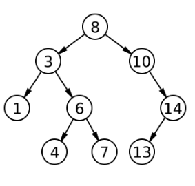

# Atividade.

Para esta atividade, é pedido que você incremente a implementação da árvore binária generalizada, implementando as seguintes funções adicionais:

**1. Escreva uma função que conte o número de folhas de uma árvore binária.**

A sua função deve ser recursiva e deve ter o seguinte protótipo:

int _count_leaves(Node *node);

  
**2. Escreva uma função que exclua todas as folhas de uma árvore binária.**

A sua função deve ser recursiva e deve ter o seguinte protótipo:

Node *_delete_leaves(Node *node);

**3. Escreva uma função recursiva que apaga todas as folhas de uma árvore que tenham a chave igual a um valor dado.**

A sua função deve ser recursiva e deve ter o seguinte protótipo:

Node* _delete_leaves_with_value(int key, Node *node);

**Observação:** Suas funções privadas devem ser recursivas e não é permitido usar variáveis globais nestas atividades.

Exercícios resolvidos com variáveis globais receberão nota ZERO.

## Ajuda

A atividade já vem com um código implementado para você seguir como ponto de partida.

O método `bshow` da árvore imprime a árvore em um formato amigável. Você pode utilizá-lo para conferir se seu código está funcionando corretamente.

Para o caso da árvore abaixo, temos essa saída.

```
//serial
1 8 7 # # 4 # 6 # # 5 0 # # 9 # 3 2 # # #

//bshow()
```


Para simplificar o código, estou utilizando a convenção _ para expressar quais são os métodos privados.

Os locais onde você deve colocar seu código estão marcados com //TODO. Como estamos lidando com árvores,

você deverá criar também os métodos recursivos privados e os métodos públicos.


Testes
>>>>>>>> um
0 4 # # 2 0 # # 3 # # 
2
========
3
0 2
0 2
0
0
<<<<<<<<

>>>>>>>> dois
7 5 9 # # 1 # # 4 2 # # 3 # #
4
========
4
7 5 4
5 7 4
7 5
5 7
<<<<<<<<

>>>>>>>> tres
1 2 # # 3 4 # 5 # # 6 # #
4
========
3
1 3 4
1 4 3
1 3
1 3
<<<<<<<<

>>>>>>>> quatro
1 6 # # 2 # 3 4 3 # # # 7 # 5 # #
7 
========
3
1 2 3 4 7
1 2 4 3 7
1 2 3 4
1 2 4 3
<<<<<<<<

>>>>>>>> cinco
1 2 # # 4 3 # # 6 # 5 7 # # 8 # #
10
========
4
1 4 6 5
1 4 6 5
1 4 6 5
1 4 6 5
<<<<<<<<


## Arquivos requeridos

#### main.cpp
<pre>
<code>
#include <iostream>
#include <string>
#include "Tree.h"
using namespace std;

int main()
{
    string line;
    int value;
    getline(cin, line);
    cin >> value;
	Tree bt(line);
    cout << bt.count_leaves() << endl;
    bt.delete_leaves();
    bt.preorder();
    cout << "\n";
    bt.inorder();
    cout << "\n";
    bt.delete_leaves_with_value(value);
    bt.preorder();
    cout << "\n";
    bt.inorder();
	return 0;
}
</code>
</pre>


#### Tree.h
<pre>
<code>
#ifndef TREE_H
#define TREE_H
#include <string>
#include <sstream>

struct Node;

class Tree {
public:
    Tree(std::string serial);
    void preorder();  // percurso em pre-ordem
    void inorder();   // percurso em ordem simetrica
    void bshow();
    void delete_leaves();
    void delete_leaves_with_value(int key);
    int count_leaves();
    ~Tree();
private:
    Node *_root;
    Node *_clear(Node *root);
    void _preorder(Node *node);
    void _inorder(Node *node);
    void _bshow(Node *node, std::string heranca);
    void _serializeTree(std::stringstream& ss, Node **node);
    Node *_delete_leaves(Node *node);
    Node* _delete_leaves_with_value(int key, Node *node);
    int _count_leaves(Node *node);
};

#endif
</code>
</pre>

#### Tree.cpp

<pre>
<code>
#include <iostream>
#include <sstream>
#include <string>
#include "Tree.h"

struct Node {
    int key;
    Node *left;
    Node *right;

    Node(int k, Node *l = nullptr, Node *r = nullptr) {
        this->key = k;
        this->left = l;
        this->right = r;
    }
};


// Construtor
Tree::Tree(std::string serial) {
    _root = nullptr;
    std::stringstream ss(serial);
    _serializeTree(ss, &_root);
}


void Tree::_serializeTree(std::stringstream& ss, Node **node) {
    std::string value;
    ss >> value;
    if(value == "#") // filho == nullptr
        return;
    int key = std::stoi(value);
    *node = new Node(key);
    _serializeTree(ss, &((*node)->left));
    _serializeTree(ss, &((*node)->right));
}


Tree::~Tree() {
    _root = _clear(_root);
}


Node *Tree::_clear(Node *node) {
    if(node != nullptr) { // caso geral: vamos liberar essa arvore
        node->left = _clear(node->left);
        node->right = _clear(node->right);
        delete node;
    }
    return nullptr;
}

void Tree::preorder() {
    _preorder(_root);
}

void Tree::_preorder(Node *node) {
    if(node != nullptr) { // Caso Geral
        std::cout << node->key << " ";
        _preorder(node->left);
        _preorder(node->right);
    }
}

void Tree::inorder() {
    _inorder(_root);
}

void Tree::_inorder(Node *node) {
    if(node != nullptr) { // Caso Geral
        _inorder(node->left);
        std::cout << node->key << " ";
        _inorder(node->right);  
    }
}

void Tree::bshow(){
    _bshow(_root, "");
}

void Tree::_bshow(Node *node, std::string heranca) {
    if(node != nullptr && (node->left != nullptr || node->right != nullptr))
        _bshow(node->right , heranca + "r");
    for(int i = 0; i < (int) heranca.size() - 1; i++)
        std::cout << (heranca[i] != heranca[i + 1] ? "│   " : "    ");
    if(heranca != "")
        std::cout << (heranca.back() == 'r' ? "┌───" : "└───");
    if(node == nullptr){
        std::cout << "#" << std::endl;
        return;
    }
    std::cout << node->key << std::endl;
    if(node != nullptr && (node->left != nullptr || node->right != nullptr))
        _bshow(node->left, heranca + "l");
}


int Tree::count_leaves() { // TODO

}

int Tree::_count_leaves(Node *node) { // TODO

}

void Tree::delete_leaves() { // TODO
  
}

Node* Tree::_delete_leaves(Node *node) { // TODO

}

void Tree::delete_leaves_with_value(int key) { // TODO

}

Node* Tree::_delete_leaves_with_value(int key, Node *node) { // TODO

}
</code>
</pre>