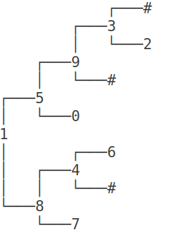

# Atividade


Para esta atividade, é pedido que você incremente a implementação da árvore binária generalizada, implementando as seguintes funções adicionais: 

1. Escreva uma função não-recursiva que calcula o número de nós de uma árvore binária dada como entrada. 

A sua função deve ser ITERATIVA e deve ter o seguinte protótipo:

<b>int _size_iterativo(Node *node);</b>

Dica: Funções iterativas em árvores, geralmente necessitam de estruturas de dados adicionais, tais como pilhas e filas.

Se for preciso, use a pilha e a fila do C++. Você pode encontrar informações sobre essas estruturas
de dados nesses links aqui:

http://www.cplusplus.com/reference/queue/queue/

http://www.cplusplus.com/reference/stack/stack/

# Observação
Não é permitido usar variáveis globais nestas atividades.
Exercícios resolvidos com variáveis globais receberão nota ZERO.

# Ajuda

A atividade já vem com um código implementado para você seguir como ponto de partida.

O método bshow da árvore imprime a árvore em um formato amigável. Você pode utilizá-lo para conferir se seu código está funcionando corretamente.

Para o caso da árvore abaixo, temos essa saída.

```
//serial
1 8 7 # # 4 # 6 # # 5 0 # # 9 # 3 2 # # #

//bshow()
```



Para simplificar o código, estou utilizando a convenção _ para expressar quais são os métodos privados.

Os locais onde você deve colocar seu código estão marcados com //TODO. Como estamos lidando com árvores,

você deverá criar também os métodos recursivos privados e os métodos públicos.


## Arquivos requeridos

#### main.cpp
<pre>
<code>
#include <iostream>
#include <string>
#include "Tree.h"
using namespace std;

int main()
{
    string line;
    getline(cin, line);
    Tree bt(line);
    cout << bt.size() << endl;
    return 0;
}
</code>
</pre>


#### Tree.h
<pre>
<code>
#ifndef TREE_H
#define TREE_H
#include <string>
#include <sstream>

struct Node;

class Tree {
public:
    Tree(std::string serial);
    void bshow();
    int size();
    ~Tree();
private:
    Node *_root;
    Node *_clear(Node *node);
    void _bshow(Node *node, std::string heranca);
    void _serializeTree(std::stringstream& ss, Node **node);
    int _size_iterativo(Node *node);
};

#endif
</code>
</pre>

#### Tree.cpp

<pre>
<code>
#include <iostream>
#include <sstream>
#include <string>
#include "Tree.h"

struct Node {
    int key;
    Node *left;
    Node *right;

    Node(int k, Node *l = nullptr, Node *r = nullptr) {
        this->key = k;
        this->left = l;
        this->right = r;
    }
};

Tree::Tree(std::string serial) {
    _root = nullptr;
    std::stringstream ss(serial);
    _serializeTree(ss, &_root);
}

Tree::~Tree() {
    _root = _clear(_root);
}

void Tree::_serializeTree(std::stringstream& ss, Node **node) {
    std::string value;
    ss >> value;
    if(value == "#") // filho == nullptr
        return;
    int key = std::stoi(value);
    *node = new Node(key);
    _serializeTree(ss, &((*node)->left));
    _serializeTree(ss, &((*node)->right));
}

Node *Tree::_clear(Node *node) {
    if(node != nullptr) { // caso geral: vamos liberar essa arvore
        node->left = _clear(node->left);
        node->right = _clear(node->right);
        delete node;
    }
    return nullptr;
}

void Tree::bshow(){
    _bshow(_root, "");
}

void Tree::_bshow(Node *node, std::string heranca) {
    if(node != nullptr && (node->left != nullptr || node->right != nullptr))
        _bshow(node->right , heranca + "r");
    for(int i = 0; i < (int) heranca.size() - 1; i++)
        std::cout << (heranca[i] != heranca[i + 1] ? "│   " : "    ");
    if(heranca != "")
        std::cout << (heranca.back() == 'r' ? "┌───" : "└───");
    if(node == nullptr){
        std::cout << "#" << std::endl;
        return;
    }
    std::cout << node->key << std::endl;
    if(node != nullptr && (node->left != nullptr || node->right != nullptr))
        _bshow(node->left, heranca + "l");
}


int Tree::size() { // TODO
    
}

int Tree::_size_iterativo(Node *node) { // TODO
    
}
</code>
</pre>