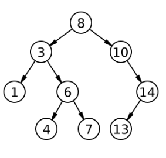

# Atividade

Para esta atividade, é pedido que você incremente a implementação da árvore binária generalizada, implementando as seguintes funções adicionais:

**1. Escreva uma função que devolva a soma de todas as chaves de uma árvore binária.**

A sua função deve ser recursiva e deve ter o seguinte protótipo:

int _sum_keys(Node *node);

  
**2. Escreva uma função que devolva o valor da menor chave de uma árvore binária.**

A sua função deve ser recursiva e deve ter o seguinte protótipo:

int _min_key(Node *node);

Essa função supõe que o ponteiro passado como parâmetro é sempre dieferente de nullptr.

**3. Escreva uma função que conte o número de nós internos de uma árvore binária.**

A sua função deve ser recursiva e deve ter o seguinte protótipo:

int _total_internal_nodes(Node *node);

**4. Escreva uma função que retorne a quantidade de nós de uma árvore binária que possuem apenas um filho.**

A sua função deve ser recursiva e deve ter o seguinte protótipo:

int _um_filho(Node *node);

**Observação:** Suas funções privadas devem ser recursivas e não é permitido usar variáveis globais nestas atividades.

Exercícios resolvidos com variáveis globais receberão nota ZERO.

## Ajuda

A atividade já vem com um código implementado para você seguir como ponto de partida.

O método `bshow` da árvore imprime a árvore em um formato amigável. Você pode utilizá-lo para conferir se seu código está funcionando corretamente.

Para o caso da árvore abaixo, temos essa saída.

```
//serial
1 8 7 # # 4 # 6 # # 5 0 # # 9 # 3 2 # # #

//bshow()
```


Para simplificar o código, estou utilizando a convenção `_` para expressar quais são os métodos privados.

Os locais onde você deve colocar seu código estão marcados com //TODO. Como estamos lidando com árvores,

você deverá criar também os métodos recursivos privados e os métodos públicos.

## Testes

```
>>>>>>>> um
0 4 # # 2 0 # # 3 # # 
========
0 92 0
<<<<<<<<

>>>>>>>> dois
7 5 9 # # 1 # # 4 2 # # 3 # #
========
1 313 0
<<<<<<<<

>>>>>>>> tres
1 2 # # 3 4 # 5 # # 6 # #
========
1 213 1
<<<<<<<<

>>>>>>>> quatro
1 6 # # 2 # 3 4 3 # # # 7 # 5 # # 
========
1 315 3
<<<<<<<<

>>>>>>>> cinco
1 2 # # 4 3 # # 6 # 5 7 # # 8 # #
========
1 364 1
<<<<<<<<
```

```
>>>>>>>> seis
-1 -3 -4 # # # -2 -1 -10 # # -9999 -20 -500 # # -13 # # # #
========
-9999 -105536 3
<<<<<<<<
```

```
>>>>>>>> sete
-6 # -7 # 7 # 6 0 # # 10 # -10 # #
========
-10 05 4
<<<<<<<<
```

```
>>>>>>>> oito
1 3 -4 # # # 2 # -1 # #
========
-4 13 2
<<<<<<<<
```

```
>>>>>>>> nove
0 0 0 # # 0 # # 0 0 # # 0 # #
========
0 03 0
<<<<<<<<
```

## Arquivos requeridos

#### main.cpp
<pre>
<code>
#include <iostream>
#include <string>
#include "Tree.h"
using namespace std;

int main(){
	string line;
    getline(cin, line);
    Tree bt(line);
    cout << bt.min_key() << " " << bt.sum_keys() << endl;
    cout << bt.total_internal_nodes() << " " << bt.um_filho() << endl;
	return 0;
}
</code>
</pre>


#### Tree.h
<pre>
<code>
#ifndef TREE_H
#define TREE_H
#include <string>
#include <sstream>

struct Node;

class Tree {
public:
    Tree(std::string serial);
    void inorder();   // percurso em ordem simetrica
    void bshow();
    int sum_keys();
    int min_key();
    int total_internal_nodes();
    int um_filho();
    ~Tree();
private:
    Node *_root;
    void _bshow(Node *node, std::string heranca);
    void _serializeTree(std::stringstream& ss, Node **node);
    Node *_clear(Node *root);
    void _inorder(Node *node);
    int _sum_keys(Node *node);
    int _min_key(Node *node);
    int _total_internal_nodes(Node *node);
    int _um_filho(Node *node);
};

#endif
</code>
</pre>

#### Tree.cpp

<pre>
<code>
#include <iostream>
#include <sstream>
#include <string>
#include <climits>
#include "Tree.h"

struct Node {
    int key;
    Node *left;
    Node *right;

    Node(int k, Node *l = nullptr, Node *r = nullptr) {
        this->key = k;
        this->left = l;
        this->right = r;
    }
};


Tree::Tree(std::string serial) {
    _root = nullptr;
    std::stringstream ss(serial);
    _serializeTree(ss, &_root);
}

void Tree::_serializeTree(std::stringstream& ss, Node **node) {
    std::string value;
    ss >> value;
    if(value == "#") // filho == nullptr
        return;
    int key = std::stoi(value);
    *node = new Node(key);
    _serializeTree(ss, &((*node)->left));
    _serializeTree(ss, &((*node)->right));
}

Tree::~Tree() {
    _clear(_root);
}

Node *Tree::_clear(Node *node) {
    if(node != nullptr) { // caso geral: vamos liberar essa arvore
        node->left = _clear(node->left);
        node->right = _clear(node->right);
        delete node;
    }
    return nullptr;
}

void Tree::inorder() {
    _inorder(_root);
}

void Tree::_inorder(Node *node) {
    if(node != nullptr) { // Caso Geral
        _inorder(node->left);
        std::cout << node->key << " ";
        _inorder(node->right);  
    }
}

void Tree::bshow(){
    _bshow(_root, "");
}

void Tree::_bshow(Node *node, std::string heranca) {
    if(node != nullptr && (node->left != nullptr || node->right != nullptr))
        _bshow(node->right , heranca + "r");
    for(int i = 0; i < (int) heranca.size() - 1; i++)
        std::cout << (heranca[i] != heranca[i + 1] ? "│   " : "    ");
    if(heranca != "")
        std::cout << (heranca.back() == 'r' ? "┌───" : "└───");
    if(node == nullptr){
        std::cout << "#" << std::endl;
        return;
    }
    std::cout << node->key << std::endl;
    if(node != nullptr && (node->left != nullptr || node->right != nullptr))
        _bshow(node->left, heranca + "l");
}


int Tree::sum_keys() { // TODO
    
}

int Tree::_sum_keys(Node *node) { // TODO

}

// Para fazer essa funcao, suponha que as arvores dos testes nunca serao vazias,
// assim, sempre havera um menor valor de chave a ser retornado
int Tree::min_key() { // TODO

}


// Supoe que o ponteiro recebido sempre eh diferente de nullptr
int Tree::_min_key(Node *node) { // TODO

}

int Tree::total_internal_nodes() { // TODO

}
    
int Tree::_total_internal_nodes(Node *node) { // TODO

}

int Tree::um_filho() { // TODO

}

int Tree::_um_filho(Node *node) { // TODO

}
</code>
</pre>