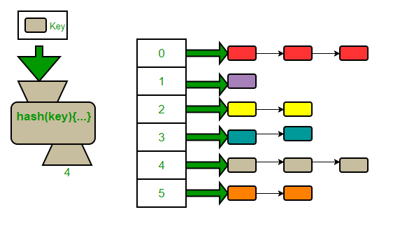

# Motivação

Para esta atividade, você deve terminar de implementar a classe genérica HashTable<K,V> que começamos a construir em sala de aula. Essa classe implementa uma table de dispersão (tabela hash) com tratamento de colisão por encadeamento exterior .

Como visto em sala, não é preciso implementar o vetor de listas encadeadas do zero, já que a tabela usa como array o contêiner std::vector da Standard Template Library (STL) do C++.

Cada elemento desse std::vector é um objeto do tipo std::list, que nada mais é do que uma lista duplamente encadeada, também disponível na STL.

Como armazenaremos na tabela não apenas as chaves mas também os valores associados a cada chave, cada elemento de uma lista encadeada deve ter a capacidade de armazenar um tipo de dado composto, um par (chave, valor).

Como tipo de dado composto, usamos o tipo de dado std::pair<K,V> do C++. Ou seja, cada elemento da std::list será um objeto do tipo std::pair<K,V>.

Deste modo, a definição que concretiza a noção de tabela hash com encadeamento exterior pode ser feita da seguinte forma:

vector<list<pair< K, V >>> *_table;
Nesta definição, K e V são tipos genéricos que representam, respectivamente, o tipo da chave e o tipo do valor associado à chave.

Esses tipos são tipos genéricos declarados no template de classe HashTable<K,V>.

Uma descrição detalhada de cada uma dessas estruturas de dados e tipos pode ser encontrada nos seguintes links:

https://www.cplusplus.com/reference/list/list/

https://en.cppreference.com/w/cpp/container/list

https://en.cppreference.com/w/cpp/container/vector

https://www.cplusplus.com/reference/vector/vector/

https://www.cplusplus.com/reference/utility/pair/

https://en.cppreference.com/w/cpp/utility/pair

Algumas funções da tabela já foram feitas (durante a aula) e outras foram deixadas para você concluir.

Por exemplo, já é possível inserir, remover e buscar chaves na tabela. 

A descrição de cada função e o que cada uma deve realizar está descrita no próprio código.

Atenção: As funções que precisam ser implementadas já foram disponibilizadas junto com a atividade, aqui mesmo nesse lab do Moodle.

## Arquivos requeridos

#### main.cpp

<pre>
<code>
// Este arquivo ja esta finalizado e foi criado 
// exclusivamente para automatizar o teste da sua HashTable.
// Nao mexa nele. Se precisar fazer testes, durante a sua codificacao, crie
// o seu proprio arquivo main.cpp e va testando as funcoes aos poucos.
// Como este arquivo supoe que todas as funcoes pedidas foram implementadas,
// ele pode nao compilar caso voce ainda nao tenha terminado de programar todas elas.
#include <iostream>
#include <sstream>
#include "HashTable.h"
using namespace std;

int main() 
{
    // cria tabela hash com 7 slots e load_factor 1.0, podendo ser aumentado ate 5.0
    HashTable<int, double> ht (7, 1.0, 5.0);

    while(true) {
        string input, command;
        getline(cin, input);
        stringstream ss {input};
        ss >> command;

        // exit
        if(command == "exit") {
            cout << "$exit" << endl;
            break;
        }
        // bucket_count
        else if(command == "bucket_count") {
            cout << "$bucket_count " << endl;
            cout << "number of buckets = " << ht.bucket_count() << endl;
        }
        // bucket_size n
        else if(command == "bucket_size") {
            cout << "$bucket_size " << endl;
            int n;
            ss >> n;
            cout << "size of bucket " << n << ": " << ht.bucket_size(n) << endl;
        }
        // bucket k
        else if(command == "bucket") {
            int k;
            ss >> k;
            cout << "$bucket " << k << endl;
            cout << ht.bucket(k) << endl;
        }
        // size
        else if(command == "size") {
            cout << "$size " << endl;
            cout << "number of pairs = " << ht.size() << endl;
        }
        // empty
        else if(command == "empty") {
            cout << "$empty" << endl;
            cout << ((ht.empty()) ? "hashtable is empty" : "hashtable is not empty") << endl;
        }
        // clear
        else if(command == "clear") {
            cout << "$clear " << endl;
            ht.clear();
        }
        // at k
        else if(command == "at") {
            int k;
            ss >> k;
            cout << "$at " << k << endl;
            try{
                double v { ht.at(k) };
                cout << v << endl;
            }
            catch(const out_of_range& e) {
                cout << e.what() << endl;
            }
        }
        // add n k1 v1 k2 v2 ... kn vn
        else if(command == "add") {
            int n;
            ss >> n;
            cout << "$add " << n << " pairs" << endl;
            for(int i = 1; i <= n; ++i) {
                int k;
                double v;
                ss >> k;
                ss >> v;
                ht.add(k, v);
            } 
        }
        // remove k
        else if(command == "remove") {
            int k;
            ss >> k;
            cout << "$remove " << k << endl;
            cout << (ht.remove(k) ? "deleted" : "no key with this value") << endl;
        }
        // loadfactor
        else if(command == "loadfactor") {
            cout << "$loadfactor" << endl;
            cout << ht.load_factor() << endl;
        }
        // change_loadfactor l
        else if(command == "change_loadfactor") {
            double l;
            ss >> l;
            cout << "$change_loadfactor " << l << endl;
            ht.load_factor(l);
        }
        // maxloadfactor
        else if(command == "maxloadfactor") {
            cout << "$maxloadfactor" << endl;
            cout << ht.max_load_factor() << endl;
        }
        // reserve n
        else if(command == "reserve") {
            int n;
            ss >> n;
            cout << "$reserve " << n << endl;
            ht.reserve(n);
        }
        // rehash m
        else if(command == "rehash") {
            int m;
            ss >> m;
            cout << "$rehash " << m << endl;
            ht.rehash(m);
        }
        // print_estatistics
        else if(command == "print_statistics") {
            cout << "$print_statistics" << endl;            
            ht.print_statistics();
        }
        // count k
        else if(command == "count") {
            int k;
            ss >> k;
            cout << "$count " << k << endl;
            cout << ht.count(k) << endl;
        }
        // copy_constructor
        else if(command == "copy_constructor") {
            HashTable<int,double> newtable (ht);
            newtable.print_statistics();
            ht.print_statistics();
            newtable.load_factor(0.5);
            newtable.print_statistics();
            ht.print_statistics();
        }
        else {
            cout << "$invalid command" << endl;
        }
    }

    return 0;
}
</code>
</pre>

####  HashTable.h

<pre>
<code>
#ifndef C7E3A516_DE69_4A35_9845_FCE0DE537053
#define C7E3A516_DE69_4A35_9845_FCE0DE537053
#include <cmath>
#include <iostream>
#include <list>
#include <vector>
#include <utility>
#include <functional>

/**
 * Class that implements a chained hash table.
 * The operations of insertion, deletion and search are executed 
 * with complexity O(1) in the medium case. 
*/
template <typename K, typename V>
class HashTable {
private:
    // attributes
    size_t _n;                                         // number os pairs
    size_t _table_size;                                // number of buckets
    std::vector<std::list<std::pair<K, V>>> *_table;   // buckets (array of lists)
    double _load_factor;                               // 0 < load factor <= max_load_lactor
    double _max_load_factor;                           // 0 < load factor <= max_load_lactor
    size_t (*_hashing)(const K& k);                    // pointer to hashing function

    // Returns the smallest prime that is greater than or equal to x.
    // x is required to be such that x > 2
    size_t get_next_prime(size_t x) const;

    // Returns an integer in the range [0 ... _table_size-1]
    // This function receives a key k and: 
    // (1) computes k's hashing code h(x) by using the function in the 
    //     private attribute _hashing if it is different from nullptr; 
    //     otherwise, it uses the std::hash template defined in the header <functional>;
    // (2) computes an index in the range [0 ... _table_size-1] 
    //     by applying the division method: h(x) % _table_size
    size_t hash_code(const K& k) const;

public:
    // Deleted functions
    HashTable& operator=(const HashTable& t) = delete; // operador de atribuicao deletado

    // Constructor: creates a a hash table with a prime number of buckets.
    // tableSize := the number of buckets of the table. Must be a prime number > 2.
    // lf  := load factor (lf > 0)
    // mlf := maximum load factor (mlf > 0 and lf <= mlf)
    // *h  := pointer to a function that receives a key k and returns 
    //        its hash code as an unsigned int
    // If the above conditions are not met, an exception must be thrown
    HashTable(size_t tableSize = 17, double lf = 1.0, double mlf = 1.0, size_t (*h)(const K& k) = nullptr);

    // Construtor de copia
    // Instancia uma tabela hash que eh a copia de outra passada
    // como argumento para este construtor
    HashTable(const HashTable& t);

    // Destructor
    ~HashTable();

    // Returns the number of buckets in the HashTable.
    // A bucket is a slot in the arrays's internal hash table 
    // to which elements are assigned based on the hash value of their key.
    // The number of buckets influences directly the load factor of the 
    // container's hash table (and thus the probability of collision). 
    size_t bucket_count() const;

    // Returns the number of elements in bucket n.
    // A bucket is a slot in the arrays's internal hash table 
    // to which elements are assigned based on the hash value of their key.
    // The number of elements in a bucket influences the time it takes 
    // to access a particular element in the bucket. 
    size_t bucket_size(size_t n) const;

    // Returns the bucket number where the element with key k is located or should be contained.
    size_t bucket(const K& k) const;

    // Returns the number of elements in the HashTable.
    size_t size() const;

    // Returns a bool value indicating whether 
    // the HashTable is empty, i.e. whether its size is 0.
    bool empty() const;

    // All the elements in the HashTable are dropped: 
    // their destructors are called, and they are removed from the container, 
    // leaving it with a size of 0.
    void clear();

    // Returns a reference to the mapped value of the 
    // element with key k in the HashTable.
    // If k does not match the key of any element in the container, 
    // the function throws an out_of_range exception.
    V& at(const K& k);

    // versao const da funcao acima
    const V& at(const K& k) const;

    // Inserts a new element in the HashTable.
    // If _n / _table_size > _load_factor then this functions calls the 
    // function rehash() passing the double of the actual size of the table.
    // The element is inserted only if its key is not equivalent 
    // to the key of any other element already in the hash table 
    // (keys in an HashTable are unique).
    // This effectively increases the hash table size by 1 if the element is inserted.
    // Returns a boolean indicating if an insertion was done.
    bool add(const K& k, const V& v);

    // Removes an element with key k from the hash table if it exists.
    // Returns a boolean indicating if a deletion was done.
    bool remove(const K& k);

    // gets the load factor
    double load_factor() const;

    // sets the load factor to a new value.
    // the argument lf must be a positive number, lf > 0, and must be such that lf <= _max_load_factor.
    // if none of these restrictions are satisfied, the function may have no effect.
    // however, if the conditions are satisfied, the load factor is set, that is _load_factor = lf, 
    // and the function reserve(_n) is called
    void load_factor(double lf);

    // gets the max load factor
    double max_load_factor() const;

    // Sets the number of buckets in the container (_table_size) to 
    // the most appropriate to contain at least n elements.
    // If n is greater than the current _table_size multiplied by 
    // the _load_factor, then the function rehash() is called with the appropriate argument. 
    // If n is lower than that, the function may have no effect.
    void reserve(size_t n);

    // Sets the number of buckets in the container to m or more.
    // If m is greater than the current number of buckets in the 
    // container (bucket_count), a rehash is forced. 
    // The new bucket count can either be equal or greater than m.
    // If m is lower than the current number of buckets in the 
    // container (bucket_count), the function may have no effect 
    // on the bucket count and may not force a rehash. 
    // A rehash is the reconstruction of the hash table: 
    // All the elements in the container are rearranged according 
    // to their hash value into the new set of buckets. 
    // This may alter the order of iteration of elements within the container.
    // Rehashes are automatically performed by the container whenever 
    // its load factor is going to surpass its max_load_factor in an operation.
    void rehash(size_t m);

    // This function prints the following data in the terminal:
    // bucket_count()
    // size()
    // load_factor()
    // max_load_factor()
    // the size of the largest bucket in the table
    void print_statistics() const;

    // If k matches the key of an element in the container, the function 
    // returns a reference to its mapped value.
    // If k does not match the key of any element in the container, 
    // the function inserts a new element with that key and returns a 
    // reference to its mapped value. Notice that this always increases 
    // the container size by one, even if no mapped value is assigned to 
    // the element (the element is constructed using its default constructor).
    V& operator;

    // Searches the container for elements whose key is k and returns 
    // the number of elements found. Because HashTable do not allow for 
    // duplicate keys, this means that the function actually returns 1 if 
    // an element with that key exists in the container, and zero otherwise.
    size_t count(const K& k) const;
};

//////////////////////////////////////////////////////////////
// Implementacao das funcoes -- funcoes ja feitas
//////////////////////////////////////////////////////////////

template <typename K, typename V>
size_t HashTable<K,V>::get_next_prime(size_t x) const {
    if(x <= 2) {
        return 3;
    }
    if(x % 2 == 0) x = x + 1;
    while(true) {
        int d {0};
        for(d = 2; d <= sqrt(x); d++) {
            if(x % d == 0) {
                break;
            }
        }
        if(d > sqrt(x)) {
            break;
        }
        x = x + 2;
    }
    return x;
}

template <typename K, typename V>
size_t HashTable<K,V>::hash_code(const K& k) const {
    if(_hashing == nullptr) {
        return std::hash<K>()(k) % _table_size;
    }
    else {
        return _hashing(k) % _table_size;
    }
}

template <typename K, typename V>
HashTable<K,V>::HashTable(size_t tableSize, double lf, double mlf, size_t (*h)(const K& k)) {
    if(lf > mlf || lf <= 0 || mlf <= 0) {
        throw std::runtime_error("argumentos errados");
    }
    _n = 0;
    _table_size = get_next_prime(tableSize);
    _table = new std::vector<std::list<std::pair<K,V>>>;
    _table->resize(_table_size);
    _load_factor = lf;
    _max_load_factor = mlf;
    _hashing = h;
}

template <typename K, typename V>
V& HashTable<K,V>::at(const K& k) {
    size_t bucket = hash_code(k);

    for(auto& par : (*_table)[bucket]) {
        if(par.first == k) {
            return par.second;
        }
    }

    throw std::out_of_range("chave inexistente");
}

template <typename K, typename V>
const V& HashTable<K,V>::at(const K& k) const {
    size_t bucket = hash_code(k);

    for(auto& par : (*_table)[bucket]) {
        if(par.first == k) {
            return par.second;
        }
    }

    throw std::out_of_range("chave inexistente");
}

template <typename K, typename V>
bool HashTable<K,V>::add(const K& k, const V& v) {
    // verifica se precisa fazer o rehash da tabela
    if( _n + 1 > _load_factor * _table_size ) {
        rehash(2 * _table_size);
    }

    size_t bucket = hash_code(k); // achei o slot

    // testa se o par ja nao existe. Se ja existir, sai sem fazer nada
    for(auto& par : (*_table)[bucket]) {
        if(par.first == k) {
            return false;
        }
    }
    // caso contrario, adiciona o par no final da lista
    (*_table)[bucket].push_back(std::make_pair(k,v));
    _n++;
    return true;
}

template <typename K, typename V>
void HashTable<K,V>::rehash(size_t m) {
    if(m <= _table_size) { 
        return;
    }

    // pega o proximo primo como tamanho da nova tabela
    size_t newSize = get_next_prime(m);

    // cria tabela hash auxiliar temporaria
    HashTable<K,V> newHT (newSize, _load_factor, _max_load_factor, _hashing);

    // adiciona os pares da tabela antiga na nova tabela
    for(size_t i = 0; i < _table_size; ++i) {
        for(auto it = (*_table)[i].begin(); it != (*_table)[i].end(); ++it) {
            newHT.add((*it).first, (*it).second);
        }
    }

    // ajustes finais
    delete _table;
    _table = newHT._table;
    newHT._table = nullptr;
    _table_size = newSize;
    std::cout << "chamou rehash(), tamanho da nova tabela: " << _table_size << std::endl;
}

template <typename K, typename V>
bool HashTable<K,V>::remove(const K& k) {
    size_t slot = hash_code(k);
    for(auto it = (*_table)[slot].begin(); it != (*_table)[slot].end(); it++) {
        if((*it).first == k) {
            (*_table)[slot].erase(it);
            _n--;
            return true;
        }
    }
    return false;
}

template <typename K, typename V>
V& HashTable<K,V>::operator {
    // antes verifica se precisa fazer o rehash da tabela
    if( _n + 1  > _load_factor * _table_size ) {
        rehash(2 * _table_size);
    }
    // verifica se ja existe par com a chave k e retorna o valor associado
    size_t slot { hash_code(k) };
    for(auto it = (*_table)[slot].begin(); it != (*_table)[slot].end(); it++) {
        if((*it).first == k) {
            return (*it).second;
        }
    }
    // caso nao exista par com a chave k, adicionamos ao final da lista
    // um novo par com chave k e com valor default
    (*_table)[slot].push_back(std::make_pair(k,V()));
    _n++;
    return (*_table)[slot].back().second;
}

template <typename K, typename V>
HashTable<K,V>::~HashTable() {
    delete _table;
}

template<typename K, typename V>
void HashTable<K,V>::print_statistics() const {
    std::cout << "--------------------------------\n";
    std::cout << "number of buckets: " << bucket_count() << std::endl;
    std::cout << "number of pairs: " << size() << std::endl;
    std::cout << "load_factor(): " << load_factor() << std::endl;
    std::cout << "max_load_factor(): " << max_load_factor() << std::endl;
    size_t max_bucket_size{0};
    for(size_t i = 0; i < bucket_count(); ++i) {
        if(max_bucket_size < bucket_size(i)) {
            max_bucket_size = bucket_size(i);
        }            
    }
    std::cout << "actual max bucket size: " << max_bucket_size << std::endl;
    std::cout << "--------------------------------\n";
}

////////////////////////////////////////////////////////////////////////////
///////// Funcoes a serem feitas
////////////////////////////////////////////////////////////////////////////

template <typename K, typename V>
size_t HashTable<K,V>::count(const K& k) const 
{
    // Fazer
}

template <typename K, typename V>
size_t HashTable<K,V>::bucket_count() const 
{
    // Fazer
}

template <typename K, typename V>
size_t HashTable<K,V>::bucket_size(size_t n) const 
{
    // Fazer
}

template <typename K, typename V>
size_t HashTable<K,V>::bucket(const K& k) const 
{
    // Fazer
}

template <typename K, typename V>
size_t HashTable<K,V>::size() const 
{
    // Fazer
}

template <typename K, typename V>
bool HashTable<K,V>::empty() const 
{
    // Fazer
}

template <typename K, typename V>
void HashTable<K,V>::clear() 
{
    // Fazer
}

template <typename K, typename V>
void HashTable<K,V>::reserve(size_t n) 
{
    // Fazer
}

template <typename K, typename V>
void HashTable<K,V>::load_factor(double lf) 
{
    // Fazer
}

template <typename K, typename V>
double HashTable<K,V>::load_factor() const 
{
    // Fazer
}

template <typename K, typename V>
double HashTable<K,V>::max_load_factor() const 
{
    // Fazer
}

template <typename K, typename V>
HashTable<K,V>::HashTable(const HashTable& t) 
{
    // Fazer
}

#endif /* C7E3A516_DE69_4A35_9845_FCE0DE537053 */
</code>
</pre>